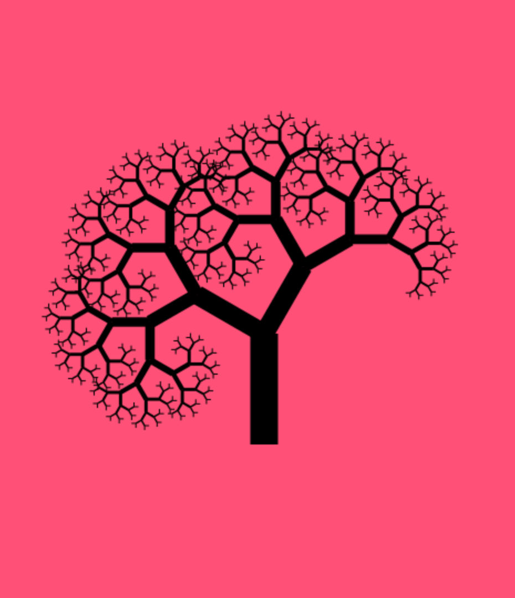

# Description

Code based heavily off the [Javascript Chain Coding Challenge](https://www.youtube.com/watch?v=VcxVDahScp8) YouTube series I discovered on Reddit awhile back.

Here's an example fractal:

